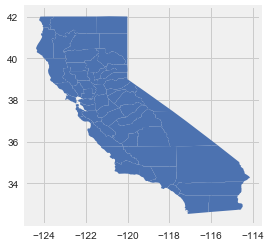
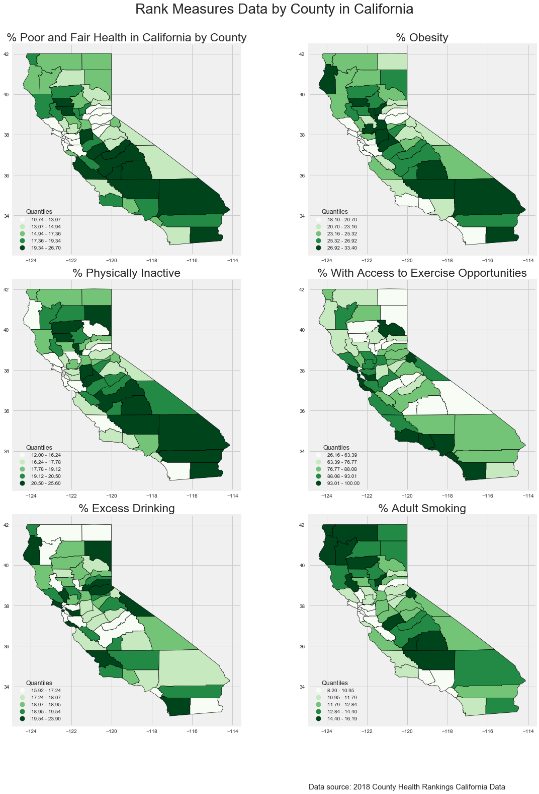

```python
import pysal as ps
import geopandas as gpd
import matplotlib.pyplot as plt
plt.style.use(['seaborn', 'fivethirtyeight'])
```

    /Users/zhanglvou/anaconda3/lib/python3.6/site-packages/pysal/__init__.py:65: VisibleDeprecationWarning: PySAL's API will be changed on 2018-12-31. The last release made with this API is version 1.14.4. A preview of the next API version is provided in the `pysal` 2.0 prelease candidate. The API changes and a guide on how to change imports is provided at https://migrating.pysal.org
      ), VisibleDeprecationWarning)


```python
cali_health = gpd.read_file('/Users/zhanglvou/Desktop/GoMailman/spring_2019/gis/Midterm_Materials_Spring19_AdvGIS/gis_midterm/data/cali_health_data.shp')
cali_health.head()
```


<div>
<style scoped>
    .dataframe tbody tr th:only-of-type {
        vertical-align: middle;
    }

    .dataframe tbody tr th {
        vertical-align: top;
    }

    .dataframe thead th {
        text-align: right;
    }
</style>
<table border="1" class="dataframe">
  <thead>
    <tr style="text-align: right;">
      <th></th>
      <th>fips</th>
      <th>county</th>
      <th>prcnt_f_</th>
      <th>prcnt_b</th>
      <th>prcnt_p_</th>
      <th>prcnt_w_</th>
      <th>prcnt_x_</th>
      <th>prcnt_s</th>
      <th>geometry</th>
    </tr>
  </thead>
  <tbody>
    <tr>
      <th>0</th>
      <td>06001</td>
      <td>alameda</td>
      <td>12.686497</td>
      <td>18.9</td>
      <td>16.7</td>
      <td>98.292889</td>
      <td>19.585025</td>
      <td>10.673533</td>
      <td>POLYGON ((-121.4785079956055 37.4828987121582,...</td>
    </tr>
    <tr>
      <th>1</th>
      <td>06003</td>
      <td>alpine</td>
      <td>16.957885</td>
      <td>22.8</td>
      <td>18.9</td>
      <td>100.000000</td>
      <td>17.413998</td>
      <td>14.802253</td>
      <td>POLYGON ((-120.0747680664062 38.70902633666992...</td>
    </tr>
    <tr>
      <th>2</th>
      <td>06005</td>
      <td>amador</td>
      <td>13.068227</td>
      <td>25.3</td>
      <td>18.2</td>
      <td>87.608621</td>
      <td>19.170722</td>
      <td>11.044437</td>
      <td>POLYGON ((-120.0747680664062 38.70902633666992...</td>
    </tr>
    <tr>
      <th>3</th>
      <td>06007</td>
      <td>butte</td>
      <td>16.273193</td>
      <td>25.4</td>
      <td>19.9</td>
      <td>73.301818</td>
      <td>18.938585</td>
      <td>14.155618</td>
      <td>POLYGON ((-121.6217498779297 39.31063461303711...</td>
    </tr>
    <tr>
      <th>4</th>
      <td>06009</td>
      <td>calaveras</td>
      <td>12.843243</td>
      <td>25.8</td>
      <td>19.4</td>
      <td>75.777788</td>
      <td>18.291472</td>
      <td>11.743991</td>
      <td>POLYGON ((-120.0690307617188 38.51995086669922...</td>
    </tr>
  </tbody>
</table>
</div>


```python
cali_health.plot();
```





```python
plt.subplots(2, 3)
```


    (<Figure size 432x288 with 6 Axes>,
     array([[<matplotlib.axes._subplots.AxesSubplot object at 0x1a1d61e780>,
             <matplotlib.axes._subplots.AxesSubplot object at 0x1a1d5c3dd8>,
             <matplotlib.axes._subplots.AxesSubplot object at 0x1a1d617828>],
            [<matplotlib.axes._subplots.AxesSubplot object at 0x1a1d68c1d0>,
             <matplotlib.axes._subplots.AxesSubplot object at 0x1a1d6afb38>,
             <matplotlib.axes._subplots.AxesSubplot object at 0x1a1d65b4e0>]],
           dtype=object))


```python
fig, ax = plt.subplots(3, 2, figsize=(17, 22))
# defining map property details
title_size = 23
legend_kwds = {'loc': 3, 'fontsize': 10,
               'title': 'Quantiles',
               'title_fontsize': 12.5}
cali_health.plot(column='prcnt_f_', legend_kwds=legend_kwds, ax=ax[0][0],
         legend=True, cmap='Greens', scheme='quantiles', k=5,
         edgecolor='k', lw=0.7)
ax[0][0].set_title('% Poor and Fair Health in California by County', fontsize=title_size)
cali_health.plot(column='prcnt_b', legend_kwds=legend_kwds, ax=ax[0][1],
         legend=True, cmap='Greens', scheme='quantiles', k=5,
         edgecolor='k', lw=0.7)
ax[0][1].set_title('% Obesity', fontsize=title_size)
cali_health.plot(column='prcnt_p_', legend_kwds=legend_kwds, ax=ax[1][0],
         legend=True, cmap='Greens', scheme='quantiles', k=5,
         edgecolor='k', lw=0.7)
ax[1][0].set_title('% Physically Inactive', fontsize=title_size)
cali_health.plot(column='prcnt_w_', legend_kwds=legend_kwds, ax=ax[1][1],
         legend=True, cmap='Greens', scheme='quantiles', k=5,
         edgecolor='k', lw=0.7)
ax[1][1].set_title('% With Access to Exercise Opportunities', fontsize=title_size)
cali_health.plot(column='prcnt_x_', legend_kwds=legend_kwds, ax=ax[2][0],
         legend=True, cmap='Greens', scheme='quantiles', k=5,
         edgecolor='k', lw=0.7)
ax[2][0].set_title('% Excess Drinking', fontsize=title_size)
cali_health.plot(column='prcnt_s', legend_kwds=legend_kwds, ax=ax[2][1],
         legend=True, cmap='Greens', scheme='quantiles', k=5,
         edgecolor='k', lw=0.7)
ax[2][1].set_title('% Adult Smoking', fontsize=title_size)
ax[2][1].annotate('Data source: 2018 County Health Rankings California Data', xy = (0, -0.3), xycoords="axes fraction", fontsize=15)
# add title
fig_title = 'Rank Measures Data by County in California'
plt.suptitle(fig_title, fontsize=28);
plt.tight_layout(rect=[0, 0, 1, 0.95])
```





```python

```
