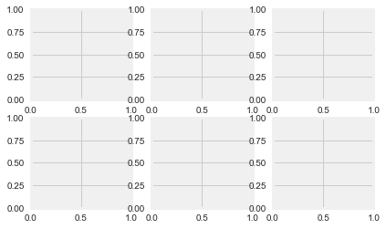
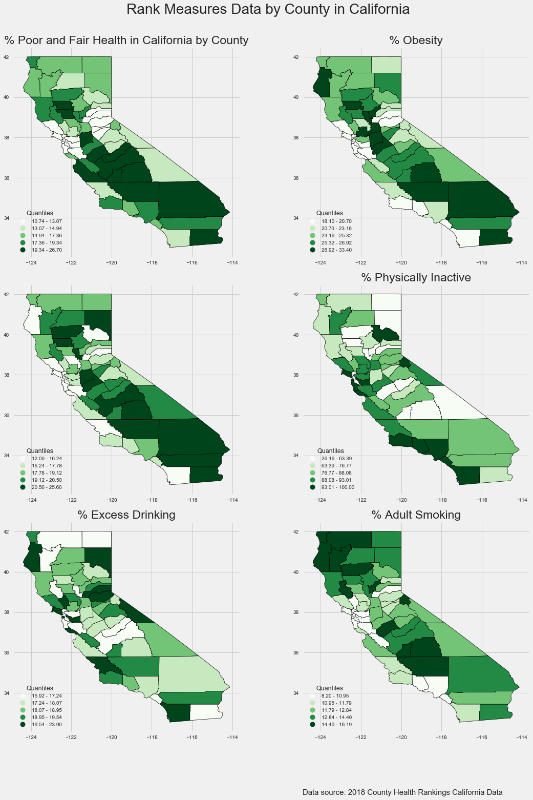

```python
import pysal as ps
import geopandas as gpd
import matplotlib.pyplot as plt
import numpy as np
import pandas as pd
plt.style.use(['seaborn', 'fivethirtyeight'])
```

cali_health = gpd.read_file('/Users/zhanglvou/Desktop/GoMailman/spring_2019/gis/Midterm_Materials_Spring19_AdvGIS/gis_midterm/data/cali_health_data.shp')
cali_health.head()

cali_health.plot();


```python
plt.subplots(2, 3)
```


    (<Figure size 432x288 with 6 Axes>,
     array([[<matplotlib.axes._subplots.AxesSubplot object at 0x1a1e951160>,
             <matplotlib.axes._subplots.AxesSubplot object at 0x1a1e975b00>,
             <matplotlib.axes._subplots.AxesSubplot object at 0x1a1e9e5470>],
            [<matplotlib.axes._subplots.AxesSubplot object at 0x1a1ea0bdd8>,
             <matplotlib.axes._subplots.AxesSubplot object at 0x1a1ea38780>,
             <matplotlib.axes._subplots.AxesSubplot object at 0x1a1ea67128>]],
           dtype=object))





```python
fig, ax = plt.subplots(2, 3)
```


```python
fig, ax = plt.subplots(3, 2, figsize=(16, 22))
# defining map property details
title_size = 23
legend_kwds = {'loc': 3, 'fontsize': 10,
               'title': 'Quantiles',
               'title_fontsize': 12.5}
cali_health.plot(column='prcnt_f_', legend_kwds=legend_kwds, ax=ax[0][0],
         legend=True, cmap='Greens', scheme='quantiles', k=5,
         edgecolor='k', lw=0.7)
ax[0][0].set_title('% Poor and Fair Health in California by County', fontsize=title_size)
cali_health.plot(column='prcnt_b', legend_kwds=legend_kwds, ax=ax[0][1],
         legend=True, cmap='Greens', scheme='quantiles', k=5,
         edgecolor='k', lw=0.7)
ax[0][1].set_title('% Obesity', fontsize=title_size)
cali_health.plot(column='prcnt_p_', legend_kwds=legend_kwds, ax=ax[1][0],
         legend=True, cmap='Greens', scheme='quantiles', k=5,
         edgecolor='k', lw=0.7)
ax[1][1].set_title('% Physically Inactive', fontsize=title_size)
cali_health.plot(column='prcnt_w_', legend_kwds=legend_kwds, ax=ax[1][1],
         legend=True, cmap='Greens', scheme='quantiles', k=5,
         edgecolor='k', lw=0.7)
ax[2][0].set_title('% With Access to Exercise Opportunities', fontsize=title_size)
cali_health.plot(column='prcnt_x_', legend_kwds=legend_kwds, ax=ax[2][0],
         legend=True, cmap='Greens', scheme='quantiles', k=5,
         edgecolor='k', lw=0.7)
ax[2][0].set_title('% Excess Drinking', fontsize=title_size)
ax[2][1].set_title('% With Access to Exercise Opportunities', fontsize=title_size)
cali_health.plot(column='prcnt_s', legend_kwds=legend_kwds, ax=ax[2][1],
         legend=True, cmap='Greens', scheme='quantiles', k=5,
         edgecolor='k', lw=0.7)
ax[2][1].set_title('% Adult Smoking', fontsize=title_size)
ax[2][1].annotate('Data source: 2018 County Health Rankings California Data', xy = (0, -0.3), xycoords="axes fraction", fontsize=15)
# add title
fig_title = 'Rank Measures Data by County in California'
plt.suptitle(fig_title, fontsize=28);
plt.tight_layout(rect=[0, 0, 1, 0.95])

```





```python

```


      File "<ipython-input-57-e0b740b24310>", line 1
        ax.annotate.?
                    ^
    SyntaxError: invalid syntax


```python

```
