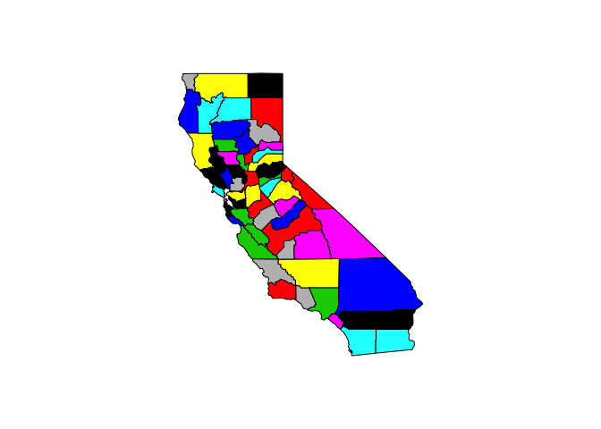
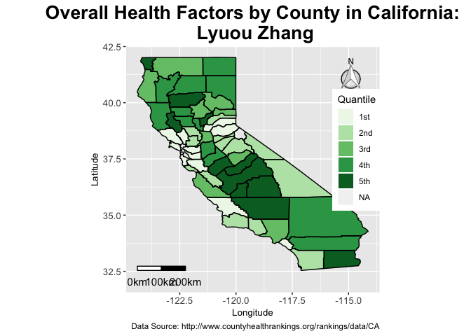
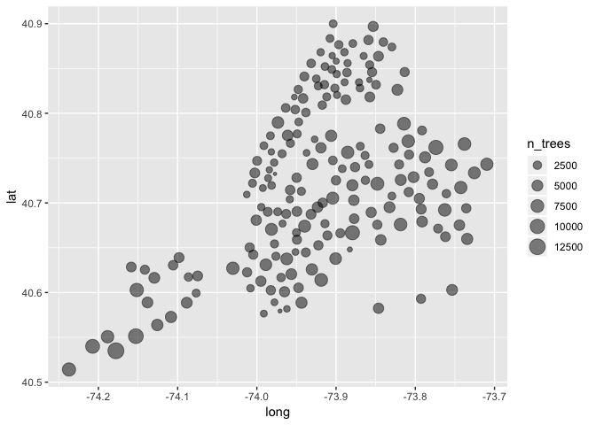
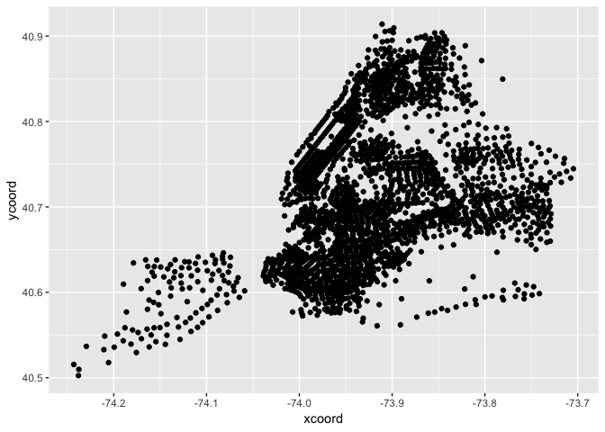
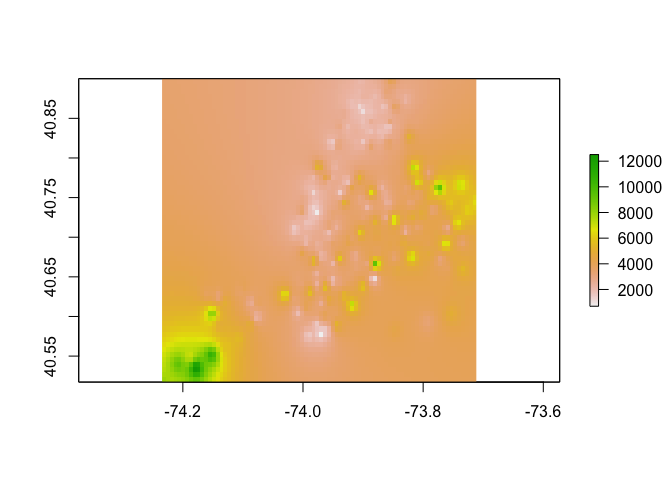

GIS Midterm
================
Lyuou Zhang
3/5/2019

## Question 1: NY County Health Rankings Data

### Import data & join

Import the California county shapefile

``` r
# import the county boundary file of California
cali_cty <- map('county', 'california', fill = TRUE, col = palette())
```

<!-- -->

``` r
# set county IDs by their names
cali_names <- str_replace(cali_cty$names, 'california,', '') %>% 
  str_replace(., ' ', '_')

# convert cali_cty map to a spatial polygon object, identified by their names
cali_cty_sp <- map2SpatialPolygons(cali_cty, IDs = cali_names, proj4string = CRS("+init=epsg:2261"))
```

Import the health ranking data:

``` r
# read the ranking data
cali_rank <- read_excel('./data/2018 County Health Rankings California Data - v3.xls', sheet = 'Outcomes & Factors Rankings', skip = 1) %>% 
  janitor::clean_names() %>% 
  dplyr::select(-state) %>% 
  dplyr::rename(
    outcome_z = z_score,
    outcome_rank = rank,
    factor_z = z_score_1,
    factor_rank = rank_1
  ) %>% 
  dplyr::filter(!is.na(county)) %>% 
  dplyr::mutate(
    factor_rank = as.integer(factor_rank),
    county = tolower(county),
    county = str_replace(county, ' ', '_')
  ) %>% 
  as.data.frame()
```

    ## Warning in evalq(as.integer(factor_rank), <environment>): NAs introduced by
    ## coercion

``` r
row.names(cali_rank) <- cali_rank$county
```

Join California map and the data of each
county

``` r
cali_df <- SpatialPolygonsDataFrame(cali_cty_sp, cali_rank, match.ID = TRUE)

cali_df$factor_z <- as.numeric(cali_df$factor_z)
```

### Plotting using ggplot

``` r
cali_df@data$id <- row.names(cali_df@data)
gpclibPermit()
```

    ## Warning in gpclibPermit(): support for gpclib will be withdrawn from
    ## maptools at the next major release

    ## [1] TRUE

``` r
cali_df.fort <- broom::tidy(cali_df, region = 'id')
```

    ## Warning in bind_rows_(x, .id): Unequal factor levels: coercing to character

    ## Warning in bind_rows_(x, .id): binding character and factor vector,
    ## coercing into character vector
    
    ## Warning in bind_rows_(x, .id): binding character and factor vector,
    ## coercing into character vector
    
    ## Warning in bind_rows_(x, .id): binding character and factor vector,
    ## coercing into character vector
    
    ## Warning in bind_rows_(x, .id): binding character and factor vector,
    ## coercing into character vector
    
    ## Warning in bind_rows_(x, .id): binding character and factor vector,
    ## coercing into character vector
    
    ## Warning in bind_rows_(x, .id): binding character and factor vector,
    ## coercing into character vector
    
    ## Warning in bind_rows_(x, .id): binding character and factor vector,
    ## coercing into character vector
    
    ## Warning in bind_rows_(x, .id): binding character and factor vector,
    ## coercing into character vector
    
    ## Warning in bind_rows_(x, .id): binding character and factor vector,
    ## coercing into character vector
    
    ## Warning in bind_rows_(x, .id): binding character and factor vector,
    ## coercing into character vector
    
    ## Warning in bind_rows_(x, .id): binding character and factor vector,
    ## coercing into character vector
    
    ## Warning in bind_rows_(x, .id): binding character and factor vector,
    ## coercing into character vector
    
    ## Warning in bind_rows_(x, .id): binding character and factor vector,
    ## coercing into character vector
    
    ## Warning in bind_rows_(x, .id): binding character and factor vector,
    ## coercing into character vector
    
    ## Warning in bind_rows_(x, .id): binding character and factor vector,
    ## coercing into character vector
    
    ## Warning in bind_rows_(x, .id): binding character and factor vector,
    ## coercing into character vector
    
    ## Warning in bind_rows_(x, .id): binding character and factor vector,
    ## coercing into character vector
    
    ## Warning in bind_rows_(x, .id): binding character and factor vector,
    ## coercing into character vector
    
    ## Warning in bind_rows_(x, .id): binding character and factor vector,
    ## coercing into character vector
    
    ## Warning in bind_rows_(x, .id): binding character and factor vector,
    ## coercing into character vector
    
    ## Warning in bind_rows_(x, .id): binding character and factor vector,
    ## coercing into character vector
    
    ## Warning in bind_rows_(x, .id): binding character and factor vector,
    ## coercing into character vector
    
    ## Warning in bind_rows_(x, .id): binding character and factor vector,
    ## coercing into character vector
    
    ## Warning in bind_rows_(x, .id): binding character and factor vector,
    ## coercing into character vector
    
    ## Warning in bind_rows_(x, .id): binding character and factor vector,
    ## coercing into character vector
    
    ## Warning in bind_rows_(x, .id): binding character and factor vector,
    ## coercing into character vector
    
    ## Warning in bind_rows_(x, .id): binding character and factor vector,
    ## coercing into character vector
    
    ## Warning in bind_rows_(x, .id): binding character and factor vector,
    ## coercing into character vector
    
    ## Warning in bind_rows_(x, .id): binding character and factor vector,
    ## coercing into character vector
    
    ## Warning in bind_rows_(x, .id): binding character and factor vector,
    ## coercing into character vector
    
    ## Warning in bind_rows_(x, .id): binding character and factor vector,
    ## coercing into character vector
    
    ## Warning in bind_rows_(x, .id): binding character and factor vector,
    ## coercing into character vector
    
    ## Warning in bind_rows_(x, .id): binding character and factor vector,
    ## coercing into character vector
    
    ## Warning in bind_rows_(x, .id): binding character and factor vector,
    ## coercing into character vector
    
    ## Warning in bind_rows_(x, .id): binding character and factor vector,
    ## coercing into character vector
    
    ## Warning in bind_rows_(x, .id): binding character and factor vector,
    ## coercing into character vector
    
    ## Warning in bind_rows_(x, .id): binding character and factor vector,
    ## coercing into character vector
    
    ## Warning in bind_rows_(x, .id): binding character and factor vector,
    ## coercing into character vector
    
    ## Warning in bind_rows_(x, .id): binding character and factor vector,
    ## coercing into character vector
    
    ## Warning in bind_rows_(x, .id): binding character and factor vector,
    ## coercing into character vector
    
    ## Warning in bind_rows_(x, .id): binding character and factor vector,
    ## coercing into character vector
    
    ## Warning in bind_rows_(x, .id): binding character and factor vector,
    ## coercing into character vector
    
    ## Warning in bind_rows_(x, .id): binding character and factor vector,
    ## coercing into character vector
    
    ## Warning in bind_rows_(x, .id): binding character and factor vector,
    ## coercing into character vector
    
    ## Warning in bind_rows_(x, .id): binding character and factor vector,
    ## coercing into character vector
    
    ## Warning in bind_rows_(x, .id): binding character and factor vector,
    ## coercing into character vector
    
    ## Warning in bind_rows_(x, .id): binding character and factor vector,
    ## coercing into character vector
    
    ## Warning in bind_rows_(x, .id): binding character and factor vector,
    ## coercing into character vector
    
    ## Warning in bind_rows_(x, .id): binding character and factor vector,
    ## coercing into character vector
    
    ## Warning in bind_rows_(x, .id): binding character and factor vector,
    ## coercing into character vector
    
    ## Warning in bind_rows_(x, .id): binding character and factor vector,
    ## coercing into character vector
    
    ## Warning in bind_rows_(x, .id): binding character and factor vector,
    ## coercing into character vector
    
    ## Warning in bind_rows_(x, .id): binding character and factor vector,
    ## coercing into character vector
    
    ## Warning in bind_rows_(x, .id): binding character and factor vector,
    ## coercing into character vector
    
    ## Warning in bind_rows_(x, .id): binding character and factor vector,
    ## coercing into character vector
    
    ## Warning in bind_rows_(x, .id): binding character and factor vector,
    ## coercing into character vector
    
    ## Warning in bind_rows_(x, .id): binding character and factor vector,
    ## coercing into character vector
    
    ## Warning in bind_rows_(x, .id): binding character and factor vector,
    ## coercing into character vector

``` r
cali_df_plot <- plyr::join(cali_df.fort, cali_df@data, by = 'id')
head(cali_df_plot)
```

    ##        long      lat order  hole piece     group      id  fips  county
    ## 1 -121.4785 37.48290     1 FALSE     1 alameda.1 alameda 06001 alameda
    ## 2 -121.5129 37.48290     2 FALSE     1 alameda.1 alameda 06001 alameda
    ## 3 -121.8853 37.48290     3 FALSE     1 alameda.1 alameda 06001 alameda
    ## 4 -121.8968 37.46571     4 FALSE     1 alameda.1 alameda 06001 alameda
    ## 5 -121.9254 37.45998     5 FALSE     1 alameda.1 alameda 06001 alameda
    ## 6 -121.9483 37.47717     6 FALSE     1 alameda.1 alameda 06001 alameda
    ##    outcome_z outcome_rank   factor_z factor_rank
    ## 1 -0.6084481           12 -0.6086862           9
    ## 2 -0.6084481           12 -0.6086862           9
    ## 3 -0.6084481           12 -0.6086862           9
    ## 4 -0.6084481           12 -0.6086862           9
    ## 5 -0.6084481           12 -0.6086862           9
    ## 6 -0.6084481           12 -0.6086862           9

``` r
# plotting with ggplot
ggplot(cali_df_plot) + aes(long, lat, group = group, fill = cut_number(factor_z, 5)) + 
  geom_polygon() +
  geom_path(color = 'black') + 
  coord_equal() + 
  scale_fill_brewer(name="Quantile", palette="Greens", 
                    labels=c("1st",
                             "2nd",
                             "3rd",
                             "4th",
                             "5th")) +
  labs(
    title = "Overall Health Factors by County in California:\n Lyuou Zhang",
    x = "Longitude",
    y = "Latitude",
    caption = "Data Source: http://www.countyhealthrankings.org/rankings/data/CA"
  ) +
  theme(axis.text=element_text(size = 10),                       
        axis.title=element_text(size = 10),
        plot.title = element_text(face="bold",size=20,hjust = 0.5),
        legend.position=c(0.91,0.58)) +
  ggsn::north(cali_df_plot, scale = 0.15, symbol=1, location="topright") +
  ggsn::scalebar(cali_df_plot, dist = 100, st.dist=0.05, st.size=4,
           dd2km = T, model = 'WGS84', 
           location="bottomleft")
```

<!-- -->

## Question 2: Mapping in Python

**This part joins all the health data with the shapefile, which is to be
used in Python**

join california map with other data

read other variables from the Excel
sheet

``` r
cali_data <- read_excel('./data/2018 County Health Rankings California Data - v3.xls', sheet = 'Ranked Measure Data', skip = 1) %>% 
  janitor::clean_names() %>% 
  select(fips, county, starts_with('percent_')) %>% 
  select(fips, county, percent_fair_poor, percent_obese, percent_physically_inactive, percent_with_access, percent_excessive_drinking, percent_smokers) %>% 
  mutate(county = tolower(county),
         county = str_replace(county, ' ', '_')) %>% 
  filter(!is.na(county)) %>% 
  as.data.frame()

# Assign row names
row.names(cali_data) <- cali_data$county

cali_poly <- SpatialPolygonsDataFrame(cali_cty_sp, cali_data, match.ID = TRUE)

#rgdal::writeOGR(cali_poly, dsn = "data", layer = "cali_health_data", driver = "ESRI Shapefile")
```

## Question 3: Interpolating trees

### Import datasets

``` r
# import trees
trees <- read_csv('./data/Trees_NTA.csv') %>% 
  janitor::clean_names() %>% 
  rename(n_trees = trees)
```

    ## Parsed with column specification:
    ## cols(
    ##   NTA = col_character(),
    ##   trees = col_integer(),
    ##   lat = col_double(),
    ##   long = col_double()
    ## )

``` r
# import tract centroids
centroid <- read_csv('./data/NYC_Tract_lat_long.csv',
                     col_types = cols(
                       GEOID = col_character()
                     )) %>% 
  janitor::clean_names()
```

### plot by longitude and latitude

``` r
# plot the trees
trees %>% 
  ggplot(aes(x = long, y = lat)) + geom_point(aes(size = n_trees), alpha = 0.5)
```

<!-- -->

``` r
# plot the centroid of tracts
centroid %>% 
  ggplot(aes(x = xcoord, y = ycoord)) + geom_point()
```

<!-- -->

### Interpolation

``` r
coordinates(trees)= ~long+lat

# create grid
grid <- trees %>% 
  spsample(., 'regular', n = 5000) %>% 
  as.data.frame()

# assign coordinates for grid
coordinates(grid) <- c("x1","x2")   
gridded(grid) <- T
fullgrid(grid) <- T

# project grid to the same projection as trees
proj4string(grid) <- proj4string(trees)

# idw and raster map
trees_idw <- gstat::idw(n_trees ~ 1, trees, newdata = grid, idp = 2.0)
```

    ## [inverse distance weighted interpolation]

``` r
raster_trees <- raster::raster(trees_idw)
plot(raster_trees)
```

<!-- -->

### Sample the raster map with the tract points

``` r
trees_xy <- centroid[,c('xcoord', 'ycoord')]
centroid$tree_sample <- raster::extract(raster_trees, trees_xy)

# data.table::fwrite(centroid, "./data/centroid.csv")
```
